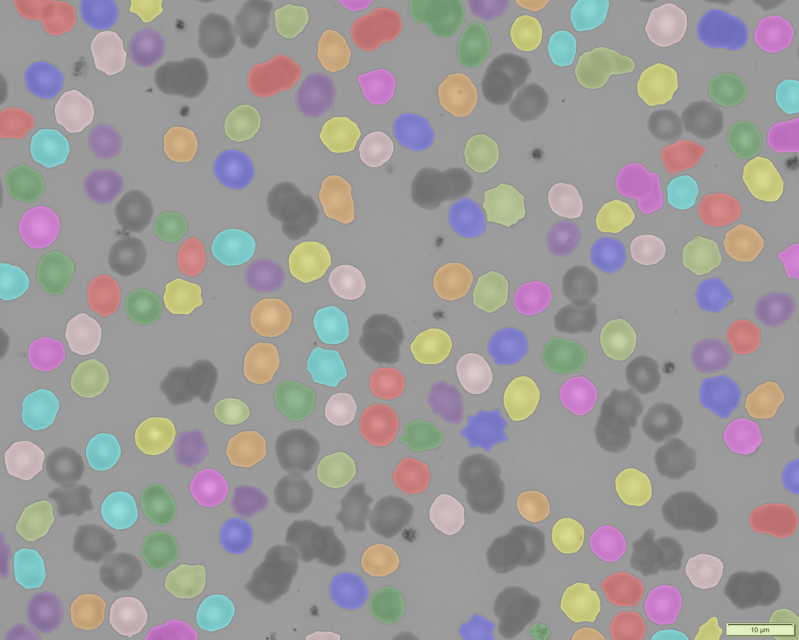
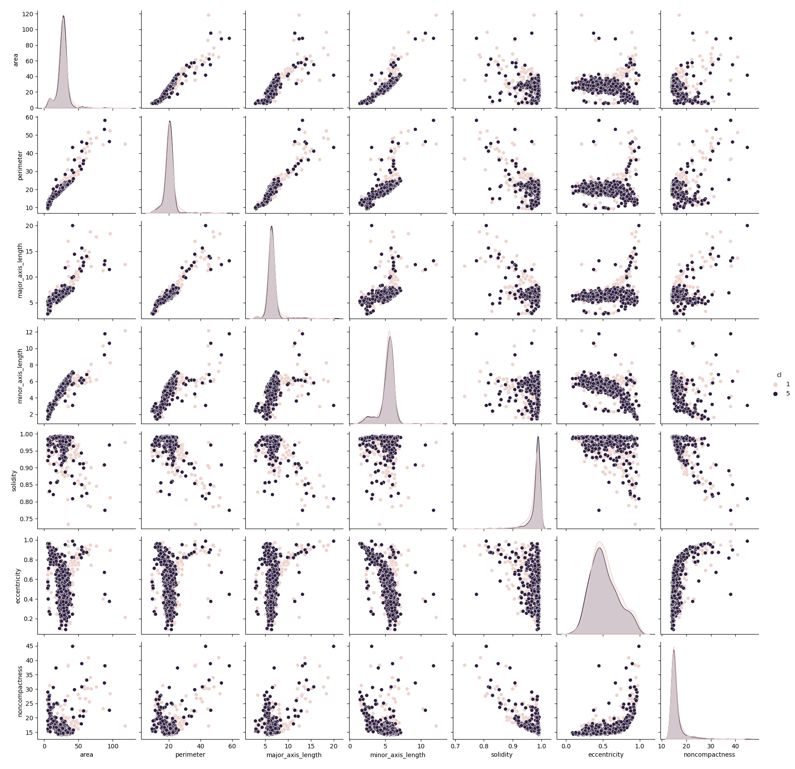

# Red Blood Cells Shape Analysis

Shape of the the red blood cell (RBC) might be indicator of several diseases. Measurement of the shape under microscope 
is time-consuming procedure and it requires specially trained expert. By using computer vision methods the procedure might be automated 
for some special cases. In Use of computer vision methods if it doto classify RBC as
normal or elongated or having other deformations has been done in [Delgado-Font2020](#Delgado-Font2020). 
In our work we aim on more delicate problem where it is not easy to distinguish the shape diferences of RBC.

The individual objects in 
Because the color in blood smear image does not bring useful information for the shape description, the image is converted into grayscale. 
The individual objects are segmented by optimal Otsu thesholding [Otsu1979](#Otsu1979). Then the shape properties of each object are measured. 
The area, perimeter are the simpliest properties. The non-compactness is given by fallowing equation.

The major axis length is the length of the major axis of the ellipse that has the same normalized second central 
moments as the region and the minor axis length is the length of the minor axis of the ellipse that has the 
same normalized second central moments as the region. Solidity is the ratio of pixels in the region to pixels of the convex hull image.
The eccentricity is the ratio of the focal distance (distance between focal points) over the major axis length. 
See [Burger2009](#Burger2009) for more information.
Then the objects smaller than 5 μm² and objects larger than 40 μm².

<figure class="image">
  
  <figcaption>Blood smear image</figcaption>
</figure>

<figure class="image">
  
  <figcaption>Otsu thresholding</figcaption>
</figure>

<figure class="image">
  
  <figcaption>
    Small objects and holed removed
  </figcaption>
</figure>

<figure class="image">
  
  <figcaption>
    Labeled image
  </figcaption>
</figure>

We were not able to proof the ability of the shape properties to distinguish two experiments `TP1` and `TP5`. 
For example, the statistics for the minor axis length can be found in fallowing table.

| Test  | statistic  | pvalue  |   
|---|---|---|
| Kolmogorov–Smirnov | 0.0726068 | 0.0726068 |
| Mann–Whitney–Wilcoxon |  187445.0 | M0.13797798 |

All scripts used for the measurement are available on [GitHub](https://github.com/mjirik/blood_cells). The measured properties 
can be found in [`csv` file](src/blood_cells.csv).

# References

## Delgado-Font2020
Delgado-Font, W., Escobedo-Nicot, M., González-Hidalgo, M. et al. Diagnosis support of sickle cell anemia by classifying red blood cell shape in peripheral blood images. Med Biol Eng Comput 58, 1265–1284 (2020). https://doi.org/10.1007/s11517-019-02085-9

## Otsu1979
Nobuyuki Otsu. A threshold selection method from gray-level histograms. IEEE Trans. Sys. Man. Cyber. 9 (1): 62–66 (1979). doi:10.1109/TSMC.1979.4310076

## Burger2009
Wilhelm Burger, Mark Burge. Principles of Digital Image Processing: Core Algorithms. Springer-Verlag, London, 2009.

## Reiss1993
T. H. Reiss. Recognizing Planar Objects Using Invariant Image Features, from Lecture notes in computer science, p. 676. Springer, Berlin, 1993.